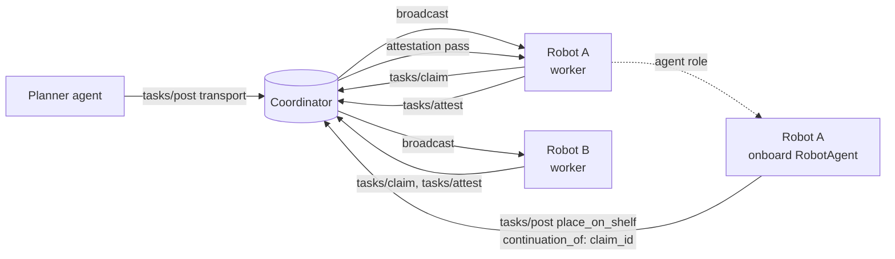

# Pattern: Robot as Agent

How to model the case where an autonomous robot's onboard controller acts as a WCP agent and dispatches follow-up work to other workers (other robots, humans, or hybrid workers). v0.95 surfaces this pattern through two informational fields (`agent_class` on the agent credential, `continuation_of` on the task descriptor) and a `RobotAgent` helper in each reference SDK.

## What this pattern is

A robot completes a task, attests, and from inside its own execute loop posts a follow-up task to another worker. The second worker may be a different class. The follow-up references the first task's `claim_id` through a `continuation_of` block so the audit chain links the two.

The canonical example is a humanoid robot completing a pick-and-carry and dispatching the place-on-shelf step to a stationary manipulator. Other cases: an autonomous mobile robot finishing a transport leg and posting a load-handoff task to a forklift; an inspection drone completing a sweep and posting an anomaly-investigation task to a ground worker; a humanoid robot escalating a stuck task to a human supervisor.

The pattern works because the WCP agent role has always been "anything holding an agent credential". v0.2 already supported this mechanically; v0.95 names it.

## What this pattern is NOT

- **Not peer-to-peer.** Robot A does not call Robot B directly. Both interact with the coordinator. The coordinator routes the follow-up task and records the audit chain entries.
- **Not swarm coordination.** This is one task to one worker, repeated. Workers do not share state during execution. See `docs/limits/swarm-boundary.md`.
- **Not joint execution.** Continuation is sequential: the first task settles, the second is posted. There is no overlap, no shared `claim_id`, no multi-worker claim.
- **Not real-time.** Latency is the standard `tasks/post` to `tasks/claim` matching latency. Robots needing sub-second handoffs should look at their local fleet protocol (VDA 5050, vendor swarm SDK, ROS 2), not WCP.

## When to use

- A humanoid robot needs to dispatch a subtask its own end-effector cannot perform.
- An AMR needs to hand off to a manipulator at the destination.
- A robot needs to escalate to a human supervisor through the same audit-chain-linked mechanism the rest of the system uses.
- A scheduled inspection robot needs to post a follow-up investigation task on anomaly detection.

## Flow

Robot A appears twice on this diagram: once as a worker (its execute role) and once as a `RobotAgent` (its agent role, running in the same process). The two roles hold different DIDs. The coordinator sees them as distinct DIDs and applies the standard matching and verifier logic to each.

## Example deployment

See `examples/agents/delivery-robot-dispatcher/`. An AMR claims a `transport` task to move a component to a workstation, attests, and posts a follow-up `place_on_shelf` task via its onboard `RobotAgent`. A stationary manipulator (`worker_class: semi_autonomous`) claims the follow-up. End-to-end against a local coordinator in under sixty seconds.

## Implementation notes

- The robot's onboard agent uses a separate DID from the robot's worker credential. The two reputations evolve independently.
- `agent_class = "embodied_agent"` is informational. Coordinators MUST NOT branch on it; operators MAY filter or surface it in monitoring.
- `continuation_of.required_evidence_kinds` lets the second worker's runbook read the prior task's attested evidence kinds before claiming. The verifier does not enforce this; it is an operator-side check.
- The follow-up task carries its own attestation requirement, settlement block, and supervision configuration. It is not bound to the first task except through the `continuation_of` reference and any operator-side runbook policy.

## What v0.95 does not add

No new RPCs. No new protocol semantics. The verifier and matching engine do not change. The forcing-function matrix passes unchanged: the robot-as-agent case adds zero per-class branches.

## See also

- `spec/0.95.md` for the normative additions.
- `examples/agents/delivery-robot-dispatcher/` for the reference deployment.
- `docs/limits/swarm-boundary.md` for the one-task-one-worker boundary.
- `rfcs/0002-subcontracting-v0.2.md` for the rejected worker-layer subcontracting design that the agent-layer continuation pattern supersedes.
