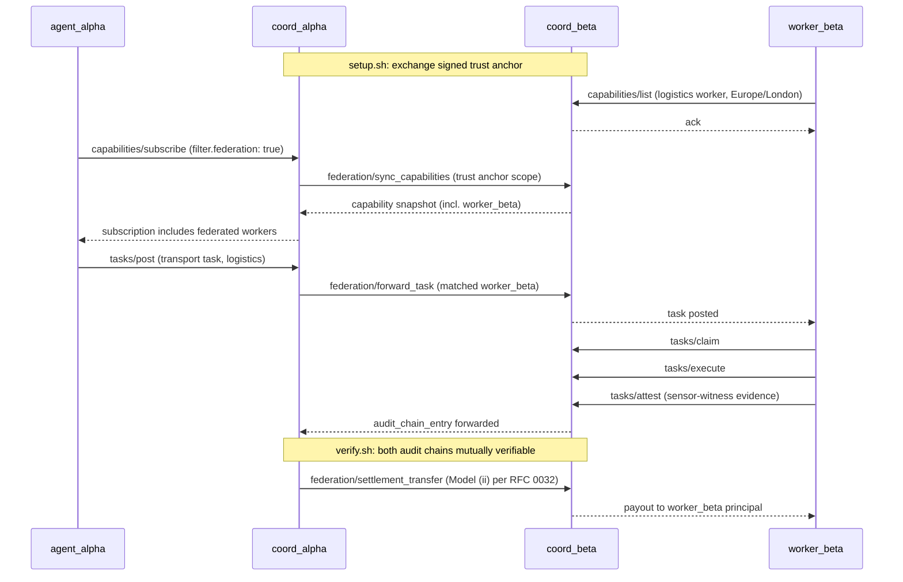

# Two-Coordinator Federation Demo

This demo shows WCP v0.955.1 federation working end-to-end: two
coordinators with mutually signed bilateral trust anchors, a worker
registered on one coordinator, an agent on the other, and a complete
task whose lifecycle crosses the federation boundary with both audit
chains verifying.

The federation primitives live in `wcp_coordinator/federation/`:
trust anchors with declared scope, capability advertisement, task
forwarding, and audit-chain interop with payload-binding plus
link-binding verification.

## Topology

```
+--------------------+         signed trust anchor          +--------------------+
|                    | <---------------------------------> |                    |
|   coord-alpha      |                                     |    coord-beta      |
|   (port 9000)      |                                     |   (port 9001)      |
|                    |                                     |                    |
|   Postgres-alpha   |                                     |   Postgres-beta    |
|   Redis-alpha      |                                     |   Redis-beta       |
|                    |                                     |                    |
+--------------------+                                     +--------------------+
         ^                                                          ^
         |                                                          |
         | tasks/post                                                | capabilities/list
         | (industrial-maintenance task)                             | (logistics worker
         |                                                          |   registered here)
         |                                                          |
+--------------------+                                     +--------------------+
|    agent_alpha     |                                     |    worker_beta     |
|  (industrial-maint |                                     |  (logistics worker |
|     dispatcher)    |                                     |   in London zone)  |
+--------------------+                                     +--------------------+

After the trust anchor is provisioned:
1. agent_alpha subscribes with filter.federation:true on coord-alpha
2. coord-alpha and coord-beta exchange capability lists per the trust anchor scope
3. agent_alpha discovers worker_beta as an eligible logistics worker
4. agent_alpha posts a task on coord-alpha with constraints matching worker_beta
5. coord-alpha forwards the task to coord-beta per federation policy
6. worker_beta claims, executes, attests
7. coord-beta's audit chain records the lifecycle
8. coord-alpha and coord-beta mutually verify the audit chain
9. Settlement clears across the federation boundary (Model (ii) per RFC 0032)
```

## Sequence diagram



## Run

### Prerequisites

- Python 3.10+ with the repo's `.venv` (or any environment with
  `wcp_coordinator` and `cryptography` installed)

### Quick start

```bash
./examples/federation-demo/setup.sh    # clean any stale demo databases
./examples/federation-demo/verify.sh   # run the end-to-end demo
```

`verify.sh` exits 0 on success. The demo runs in under a second.

### What setup.sh + verify.sh do

The actual demo logic lives in `demo.py`. It:

1. Spins up `coord-alpha` and `coord-beta` in-process, each with its
   own ephemeral SQLite database.
2. Generates Ed25519 keys for both coordinators and mutually exchanges
   signed bilateral trust anchors. Both signatures are verified before
   the anchors are stored.
3. Registers a logistics worker (London-zone-c) on `coord-beta`.
4. Has `coord-alpha`'s capability-sync record a
   `federation_capability_advertised` audit entry for the peer worker.
5. Has `coord-alpha`'s federation router pick the peer, forward a
   `tasks/post` (transport task) to `coord-beta` through the in-process
   forwarder, and record `federation_task_forwarded` on alpha's chain.
6. Has `coord-beta` record `task_claimed` and `task_completed` for the
   forwarded task on its own chain.
7. Has `coord-alpha`'s audit-export module fetch beta's chain segment,
   verify link continuity, link binding, and payload binding, and
   record `federation_audit_chain_imported` on alpha's chain.
8. Runs `verify_chain` on beta's chain and confirms the completion
   event was found and verified.

### Pass criteria

`verify.sh` is exit 0 only when ALL of:
- both trust-anchor signatures verify
- the forward succeeds and the peer reports `eligible_workers_count >= 1`
- `import_peer_chain` returns `ok=True` with a `task_completed`
  completion event
- `verify_chain` on beta's chain returns True
- alpha records exactly the three federation entry kinds
  (`federation_capability_advertised`, `federation_task_forwarded`,
  `federation_audit_chain_imported`)

### Docker variant

`docker-compose.yml` describes a two-container variant with separate
Postgres backends. The in-process `demo.py` is the canonical artifact
for the paper's Section 6 claim; the Docker variant is supplementary
and exercises the same federation primitives over real HTTP transport.

## What this proves

- Federation works across coordinator boundaries with bilateral
  signed trust anchors (no central directory, no global registry).
- Capability discovery, task posting, and audit-chain interop all
  ride on the existing eight RPCs. The only protocol additions are
  three audit-chain entry kinds; no new wire calls.
- Audit chain integrity is preserved across coordinators. Payload
  tampering and link breaks in a peer's exported chain are caught
  by the local importer.
- Trust anchors are policy-gated: a peer that requests
  `audit_chain_export` but only has `capability_discovery` scope is
  silently refused (no exception, no chain entry).

## Documents this demo references

- `spec/0.955.md`: the v0.955 protocol surface (8 RPCs)
- `rfcs/0016-federation-primitives.md`: federation trust anchors and
  capability sync (as amended at v0.955)
- `wcp_coordinator/federation/`: the federation module this demo
  exercises end-to-end
- `wcp_coordinator/tests/test_federation.py`: the 11 unit tests that
  pin the federation invariants
