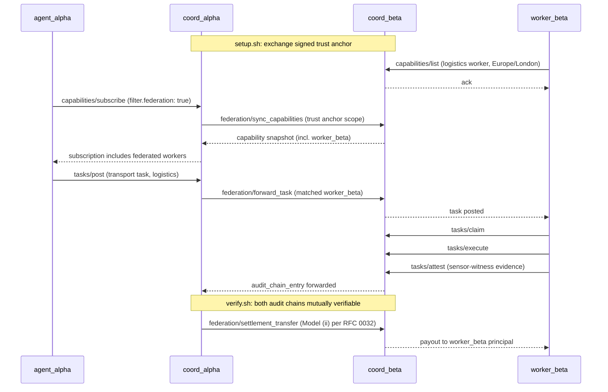

# Two-Coordinator Federation Demo

**v0.955 status:** this demo was authored against the v0.95 / v0.2 surface, which included settlement primitives. v0.955 removed those from the protocol; the demo's settlement-related steps now live above WCP. The federation primitives the demo exercises (capability discovery, task forwarding, audit-chain interop) remain protocol-layer. A rewrite of this demo against the v0.955 surface is tracked as follow-on work.

This demo shows WCP federation in action: two coordinators peering via a signed trust anchor, a worker registered on one coordinator, an agent operating on the other, and a complete task lifecycle crossing the federation boundary with mutually verifiable audit chains.

The presence of this demo turns "WCP supports federation" from claim into evidence.

## Topology

```
+--------------------+         signed trust anchor          +--------------------+
|                    | <---------------------------------> |                    |
|   coord-alpha      |                                     |    coord-beta      |
|   (port 9000)      |                                     |   (port 9001)      |
|                    |                                     |                    |
|   Postgres-alpha   |                                     |   Postgres-beta    |
|   Redis-alpha      |                                     |   Redis-beta       |
|                    |                                     |                    |
+--------------------+                                     +--------------------+
         ^                                                          ^
         |                                                          |
         | tasks/post                                                | capabilities/list
         | (industrial-maintenance task)                             | (logistics worker
         |                                                          |   registered here)
         |                                                          |
+--------------------+                                     +--------------------+
|    agent_alpha     |                                     |    worker_beta     |
|  (industrial-maint |                                     |  (logistics worker |
|     dispatcher)    |                                     |   in London zone)  |
+--------------------+                                     +--------------------+

After the trust anchor is provisioned:
1. agent_alpha subscribes with filter.federation:true on coord-alpha
2. coord-alpha and coord-beta exchange capability lists per the trust anchor scope
3. agent_alpha discovers worker_beta as an eligible logistics worker
4. agent_alpha posts a task on coord-alpha with constraints matching worker_beta
5. coord-alpha forwards the task to coord-beta per federation policy
6. worker_beta claims, executes, attests
7. coord-beta's audit chain records the lifecycle
8. coord-alpha and coord-beta mutually verify the audit chain
9. Settlement clears across the federation boundary (Model (ii) per RFC 0032)
```

## Sequence diagram



## Run

### Prerequisites

- Docker and Docker Compose installed
- Python 3.10+ (for the worker and agent scripts)
- wcp-sdk Python package (`pip install wcp-sdk` from PyPI, or `pip install -e ../../wcp_sdk_python` in development)

### Quick start

```bash
cd examples/federation-demo
docker compose up -d            # bring up both coordinators + databases
./setup.sh                       # provision trust anchor between coord-alpha and coord-beta
python worker_beta.py &          # register logistics worker on coord-beta
python agent_alpha.py            # post a task from coord-alpha; watch federation in action
./verify.sh                      # confirm audit chains on both coordinators are mutually verifiable
```

Or with the WCP CLI:

```bash
wcp dev --example federation-demo
```

(Brings up the full demo in one command.)

### Expected output

The exact output is whatever `setup.sh` and `verify.sh` actually print
when you run them against a live two-coordinator deployment. Inline
"expected output" snippets are deliberately omitted from this README to
avoid drift between the documented and the actual behaviour; copy/paste
the real output from your own run if you need a reference.

### Cleanup

```bash
docker compose down -v
```

(removes containers and volumes)

## What this proves

- Federation works across coordinator boundaries with bilateral trust anchors (no central authority).
- Capability discovery, task posting, and task execution all cross the federation boundary using the existing eight RPCs (no new RPCs needed for federation; the trust anchor and routing are operator-side).
- Audit chain integrity is preserved across coordinators; cryptographic verification holds.

## Known limitations of this demo

- The trust anchor is provisioned via a shared secret in `setup.sh` for simplicity. Production deployments use signed certificates per the federation trust anchor spec.
- The settlement transfer in the demo uses a stub escrow provider; production uses operator-chosen providers per RFC 0032.
- The two coordinators run on the same host (different ports). Production deployments separate them by network for isolation.
- Worker-beta is a stub logistics worker; for industrial-maintenance, scientific-ops, or other domains, swap the worker script with the matching reference agent worker from `examples/agents/`.

## Documents this demo references

- `spec/0.2.md`: the protocol
- `rfcs/0016-federation-primitives.md`: federation trust anchors and capability sync
- `rfcs/0032-cross-coordinator-settlement-clearing.md`: settlement transfer across federation
- `conformance/test-suite/level3.json`: the Level 3 conformance cases this demo validates

## v1.1 extensions

When v1.1 lands, this demo is extended:

- Multibase identifier migration (RFC 0031): worker_beta's DID uses `did:wcp:z<base58btc>` form; coord-alpha and coord-beta exchange both legacy and multibase identifiers during the compatibility window.
- Attestation key trust classes (RFC 0033): worker_beta declares `hardware-attested-tpm2` trust class; agent_alpha's task posts `minimum_trust_class: hardware-attested-tpm2`.
- External trust-root signed evidence (RFC 0034): worker_beta emits a `external-trust-root.iso-3691-4-amr-compliant` evidence kind tied to ISO 3691-4 certification PKI.
